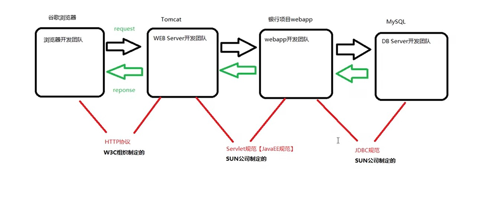

# 一、BS架构


## ①BS优点

```markdown
- 升级维护方便，成本低。只需要升级服务器

- 不需要安装客户端，有浏览器即可
```


## ②BS缺点

```markdown
- 界面不美观。浏览器只支持`html,css,js`

- 响应速度慢，数据全都是从服务器响应的

- 不安全，因为数据全部保存在服务器
```


## ③WEB通讯过程

```markdown
1. 用户输入url

2. 域名解析器解析url

3. 浏览器在网络中找到解析出来的计算机ip地址

4. 在这条计算机上找到端口号对应的软件，即web服务器软件

5. 然后再找到web服务器下的用户请求的某个资源以字符串响应给浏览器

6. 浏览器接受字符串（一般为HTML）解析并渲染。
```


# 二、★BS系统中的角色以及协议



## ①WEB通讯角色

```markdown
- web浏览器：谷歌，火狐等等

- web服务器：
	Tomcat（web服务器）
	jBoss（应用服务器）
	jetty
	Weblogic
	WebSphere

- 数据库服务器：MySQL，Oracle

- webapp：就是我们JavaWeb程序员开发的程序

- 应用服务器与WEB服务器：
	1. web服务器只实现了Servlet+Jsp核心规范
	
	2. 应用服务器实现了JavaEE全部的13种规范
```


## ②WEB协议规范

```markdown
- 浏览器与web服务器：遵守HTTP协议

- web服务器和webapp：遵守JavaEE规范，servlet也是JaveEE规范之一

- webapp和数据库服务器：遵守JDBC规范

💮💮💮💮💮💮💮💮💮💮💮💮💮💮💮💮💮💮💮💮💮💮💮💮💮💮💮💮💮💮💮💮💮💮💮💮💮💮💮💮💮💮💮💮💮

- 对于web服务器和webapp之间的规范Servlet来说，程序员是实现者，要写servlet规范的实现类让Tomcat调用。做到了服务器与app解耦

- webapp和数据库服务器之间的规范来说，程序员是调用者，实现类是由数据库厂商写的，比如MySQL的驱动就是JDBC的实现类，程序员只需要调  用它的实现类就可以操作数据库了
```


# 三、CS架构


## ①CS优点

- 界面美观
- 响应速度快
- 安全
- 服务器压力小，因为部分数据集成在了客户端

## ②CS缺点

- 升级维护不方便。