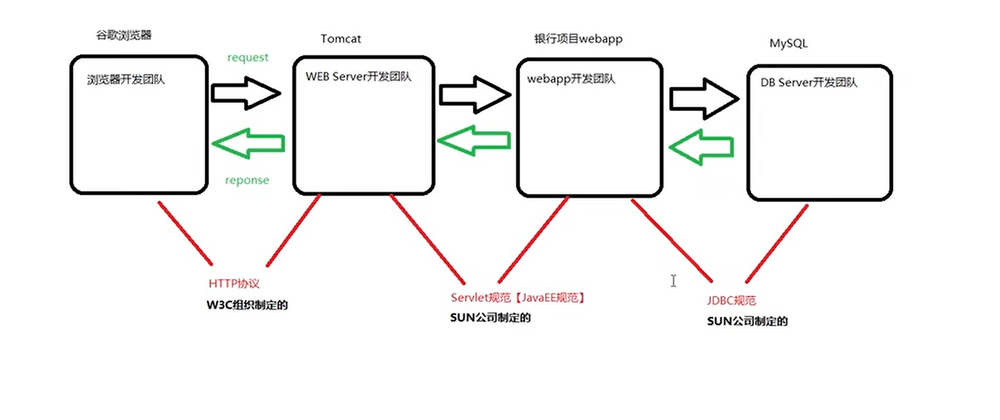
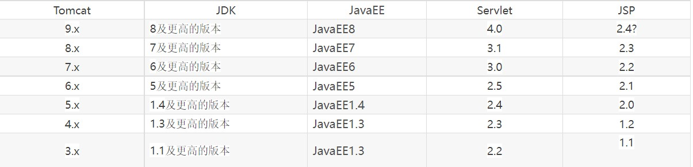

# 一、Servlet本质代码模拟


# 二、Servlet规范是什么

## ①描述

```markdown
1. Servlet规范的主要作用就是让服务器与app解耦合

2. Servlet规范分为两部分

	（1）硬性规范：即Servlet API。规定了Servlet的每个接口，每个方法做什么.服务器调用Servlet API就行了。而开发者则面向Servlet API做实现
	
	（2）软性规范：规定了app的目录结构，配置文件，文件路径，每个文件做什么等等。这样服务器才能找到我们写的Servlet实现类

只有服务器开发商与app开发者都遵守这套规范，才能做到服务器与app解耦合
```




## ②JavaEE规范与Servlet版本

```markdown
1. JavaEE规范有13种技术，如Servlet，Jsp，JPA，EJB...。JavaEE规范目前最高版本是JavaEE8，之后是JkatarEE9

2. 每一个版本的JavaEE规范，其包含的技术版本都不同，如JavaEE7中Servlet的版本是3.1，而JavaEE8中Servlet的版本就是4.0

3. 从JkatarEE开始，。Servlet的包名由javax变为jkatar。Tomcat9及之前的版本只能识别javax，如果使用JkatarEE的Servlet规范，就要Tomcat9以上的版本才能识别

```

